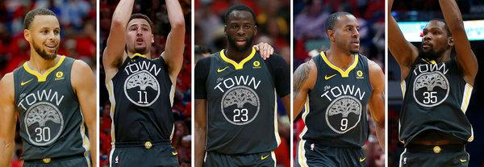

Workout 1
================
Francesco Dalla Ricca

**The Hampton 5 show what the peak is for each of their relative positions**
============================================================================

The Hampton 5 are the currently the greatest lineup in the current NBA scene, possibly even in all of NBA history. Sometimes (mistakenly) named the 'death lineup' (which is actually the name of a different lineup) they are notorious for being a powerful force to be reckoned with. Their dominance helps show shows what each of the positions can do when used by the greatest lineup. In basketball there are 5 positions that are to be filled: the point guard (PG), the shooting guard (SG), the small forward (SF), the power forward (PF), and the center. The roles are important in the functioning of the lineup and each role has different responsibilities that require players of different strengths to fulfill. The point guard (the position held by Stephen Curry) is responsible for staying in the back and passing the ball into favorable positions. Due to the nature of their position, they tend to stay far back and hardly engage in short ranged shots. The shooting guard (held by Klay Thompson and Andre Iguodala) has a job similar to the point guard in that they make plays to assist the team, except they do so from the side of the court rather than the center where the point guard resides. For the same reason, when they shoot, they often shoot for 3 pointers. The small forward (held by Kevin Durant and Andre Iguodala) resides closer to the basket, but not as close as the power forward. Because they inhabit this 'in-between' region, they have to be versatile with how they play, along with the shots they take being a combination of 3 pointers and 2 pointers. The power forward (held by Draymond Green) is much closer to the net than the previous 3 and in turn they're expected to be effective shooters at medium to close range. Because of this, they tend to be physically bigger than the previous 3 positions and as a result when it comes to defense, they guard vs the bigger and stronger players of the opposing team. Center (which is not played by anyone in the Hampton 5) plays right next to the basket, often recovering missed shots. As a result, most of their shots are taken within close quarters of the basket. With these positions and the roles they fulfill in mind, we turn to a table and a chart that shows where each of these players took shots. The background is that of a basketball court to better visualize the data.

    ## [1] "figure  1"

    ##             name total made perc_made
    ## 1 Andre Iguodala   210  134  63.80952
    ## 2 Draymond Green   346  171  49.42197
    ## 3   Kevin Durant   643  390  60.65319
    ## 4  Klay Thompson   640  329  51.40625
    ## 5  Stephen Curry   563  304  53.99645

    ## [1] "figure 2"

    ##             name total made perc_made
    ## 1 Andre Iguodala   161   58  36.02484
    ## 2 Draymond Green   232   74  31.89655
    ## 3   Kevin Durant   272  105  38.60294
    ## 4  Klay Thompson   580  246  42.41379
    ## 5  Stephen Curry   687  280  40.75691

    ## [1] "figure 3"

    ##             name total made perc_made
    ## 1 Andre Iguodala   371  192  51.75202
    ## 2 Draymond Green   578  245  42.38754
    ## 3   Kevin Durant   915  495  54.09836
    ## 4  Klay Thompson  1220  575  47.13115
    ## 5  Stephen Curry  1250  584  46.72000

 This data shows how the position each player takes affects the kinds of shots they take and in turn show what their respective position should be doing. Andre Iguodala takes a mix of 3 pointers and 2 pointers and the shot placement is diverse- as one would expect from a small forward. In addition to being a small forward, he is also a shooting guard which is why he also has quite a few shots from outside the 3-point line. Draymond Green has a very large cluster of shots right under the basket. This is a result of his position as a power forward. The chart also shows that he takes a lot of shots from the 3-point line which is an anomaly for a power forward, but when looking at figure 2 it is more in line with what one would expect from a power forward: he MISSES these 3 point shots more than *any other player* in the lineup, suggesting that pressure from the opposing team forces him to often take shots from the 3 point line, a position where he as a power forward is uncomfortable with shooting at. Kevin Durant, like Andre Iguodala, takes shots from a wide variety of places on the field, but as seen in figure 3 he takes more shots than Andre with higher overall accuracy. This make it seem like Andre is just a worse version of Kevin, but this data only shows shot data; Andre is a very powerful defender- often defending against the likes of LeBron James, the best basketball player of all time according to himself. His defensive capabilities are not shown by the tables and image above, and his defensive prowess justifies his spot on the lineup. Klay Thompson takes shots from all over the field, but takes much more shots from the 3-point line, more than double the players in positions that put them closer to the hoop (figure 2). In addition, as seen in the image, a lot of the 3-point shots are taken at the left and right side of the 3-point line, as that is where he is situated as a shooting guard. Alongside Klay, Stephen Curry also takes a lot of 3-point shots- in fact he is the only one in the lineup who takes more 3-point shots than he does 2-point shots (figures 1 and 2). However, unlike Klay, the 3-point shots he takes are closer to the top of the 3-point line rather than the sides since his position places him in that area more often than not. The Hampton 5 show that the ideal team composition should consist of people who are specialized in a role but who are also able to be flexible and take shots they wouldn't normally take in order to adapt to pressure from the opposing team. For any other lineup to match them, it is not enough to have 'good' or eve 'great' players; they need a diversity of players who each have peak strengths in different areas that help fulfill their role.

Sources: "Andre Iguodala." Wikipedia, Wikimedia Foundation, 3 Mar. 2019, en.wikipedia.org/wiki/Andre\_Iguodala. "Basketball Positions." Wikipedia, Wikimedia Foundation, 5 Mar. 2019, en.wikipedia.org/wiki/Basketball\_positions. "Basketball." Wikipedia, Wikimedia Foundation, 13 Mar. 2019, en.wikipedia.org/wiki/Basketball. Bonsor, Kevin. "How Basketball Works." HowStuffWorks, HowStuffWorks, 10 Mar. 2003, entertainment.howstuffworks.com/basketball.htm. "Draymond Green." Wikipedia, Wikimedia Foundation, 25 Jan. 2019, en.wikipedia.org/wiki/Draymond\_Green. "Kevin Durant." Wikipedia, Wikimedia Foundation, 19 Feb. 2019, en.wikipedia.org/wiki/Kevin\_Durant. "Klay Thompson." Wikipedia, Wikimedia Foundation, 9 Mar. 2019, en.wikipedia.org/wiki/Klay\_Thompson. "Stephen Curry." Wikipedia, Wikimedia Foundation, 22 Feb. 2019, en.wikipedia.org/wiki/Stephen\_Curry.
